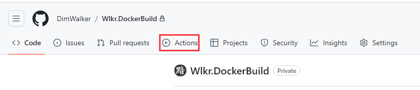
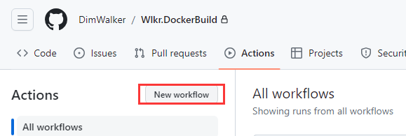
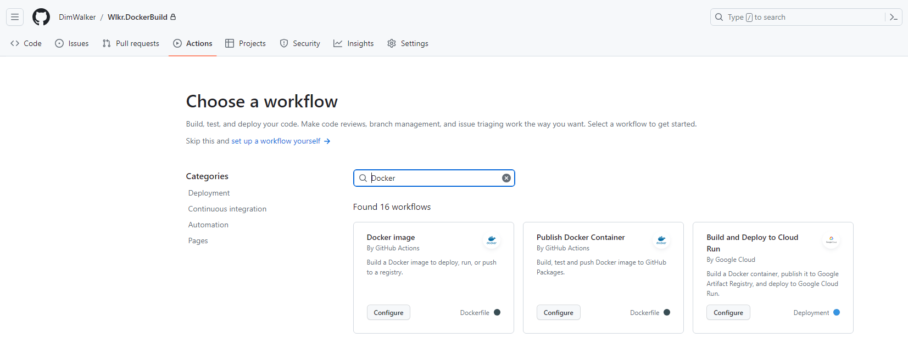
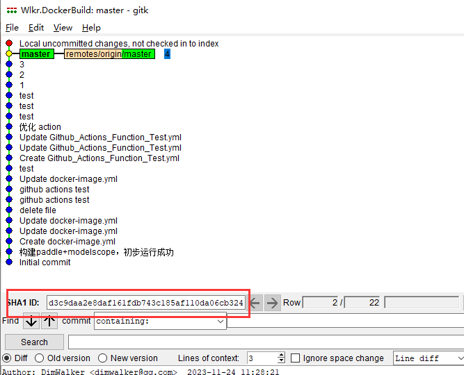
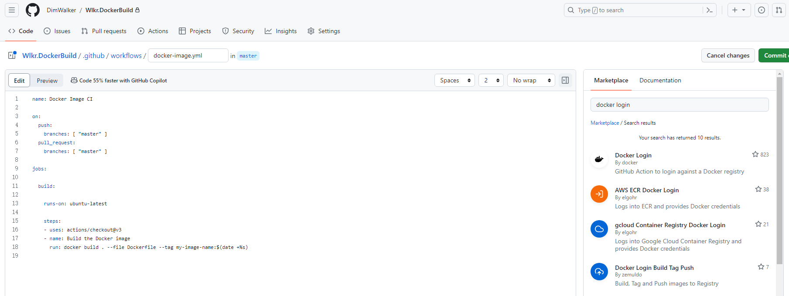
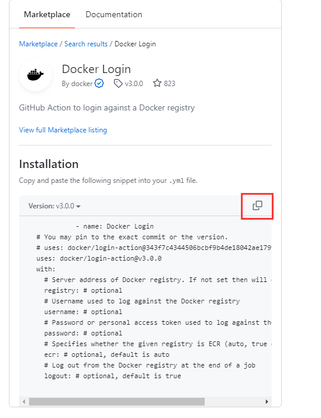
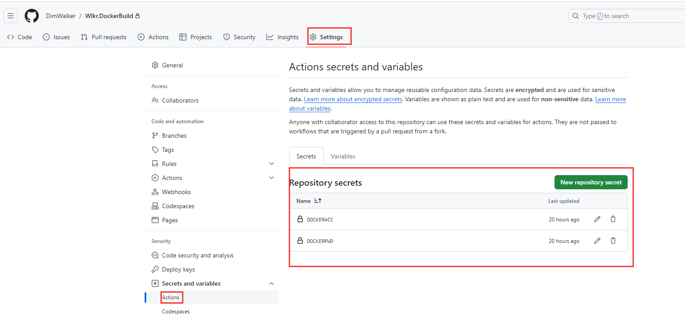
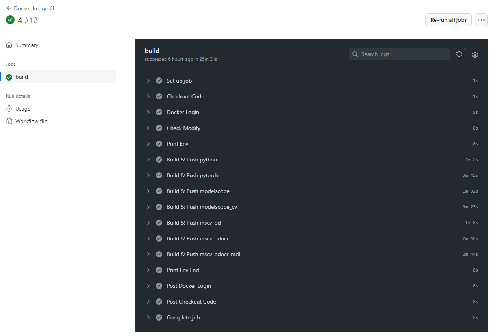

[](https://www.dimtechstudio.com/)  

# [GitOps] 白嫖神器Github Actions，构建、推送Docker镜像一路畅通无阻  

## 引言  
&emsp;&emsp;当你没找到合适的基础的Docker镜像时，是否会一时冲动，想去自己构建。然而因为网络问题，各种软件官方源、镜像源（包括但不限于apt、pip、maven，npm），不但编译奇慢无比，还时常出错白白浪费几十个G的网络流量；硬件问题，爱用Windows但装WSL开了Hyper-V玩不了模拟器，用虚拟机又觉得麻烦占磁盘空间，还没钱续期云服务器……  
&emsp;&emsp;我的朋友，如果你还在为以上种种问题而苦恼，那么我很荣幸为你推荐<span style='color:red;'>~~Nuget~~</span> GitOps，Github Actions!  
&emsp;&emsp;GitOps，作为一种现代化的运维理念，强调通过版本控制系统来管理基础设施和应用配置，提高可维护性和可靠性。在这个背景下，Github Actions作为一项强大的CI/CD工具，为我们提供了优雅的解决方案。本文将深入探讨如何充分利用Github Actions服务，白嫖其强大的构建能力，实现Docker镜像的自动构建与推送，确保网络畅通无阻。  
【不得不说同样是官方源，Nuget就极少像前面几个源出问题，.net yyds！】  

## Github Actions简介  
&emsp;&emsp;Github Actions是Github提供的一项持续集成和持续交付服务，与仓库无缝集成，可通过简单的YAML配置文件定义工作流程。这使得我们能够轻松地在代码仓库中管理和执行CI/CD任务，提高开发和部署的效率。借助Github Actions，我们可以构建、测试和部署项目，将整个开发周期变得更加流畅。  
&emsp;&emsp;GitHub可以提供 Linux、Windows 和 macOS 虚拟机来运行你的工作流程，在使用Github Actions之前，你需要了解以下前置知识:  
* Yaml基础语法  
* Linux（或Windows或macOS）脚本相关知识  
* Git及Github的相关知识  

### 什么是Yaml  
&emsp;&emsp;当创建Github Actions时，会在代码库.github/workflows目录下，创建一个.yml 文件，每个yml对应一个工作流。  
&emsp;&emsp;YAML（YAML Ain't Markup Language或YAML是一个人类可读的数据序列化格式）是一种简洁且易读的数据标记语言。它常被用于配置文件和数据交换格式，以人类可读的方式表示数据结构，有以下几个特点:  
* 大小写敏感。  
* 使用缩进表示层级关系。  
* 缩进只能使用空格，不能用 TAB 字符。  
* 缩进的空格数量不重要，只要层级相同的元素左对齐即可。  
* #表示注释。  

### Github Actions的Yaml结构  
* name：workflow名称  
* on：触发器  
* env：自定义的环境变量  
* job：一个workflow可以有多个job，每个job包含多个step  
* runs-on：任务容器，如ubuntu-latest，windows-latest，macos-latest  
* step：任务步骤  
* action：每个步骤可以执行多个命令  

### Github Actions的使用限制  
&emsp;&emsp;Github Actions可以免费使用，也可以付费使用，其中免费用户有以下限制：  
* 使用时长  
可以每月使用2000分钟，存储500MB（应该是指仓库大小），其中不同容器时间系数是不同的，Linux是1，Windows是2（1000分钟），MacOS是10（200分钟）；  
* 并发作业数20  
* 作业执行时间最长6小时  
* 工作流运行时间每次工作流运行时间限制为 35 天  
（笔者没看懂这项目）  

&emsp;&emsp;更详细内容可以在官网中找到[usage-limits-billing-and-administration](https://docs.github.com/zh/actions/learn-github-actions/usage-limits-billing-and-administration)  

##  Docker镜像的构建  
&emsp;&emsp;在Github Actions中配置Docker镜像构建的过程非常简单。通过定义workflow，我们可以指定触发条件、构建步骤和依赖关系。配置一个构建步骤，执行Docker镜像的构建，确保在每次代码推送时触发自动构建流程。这种自动化的构建流程不仅提高了效率，还减少了人为出错的可能性。  

### 新建workflow  
&emsp;&emsp;首先打开你的Github 代码库，点击Actions  
  
&emsp;&emsp;点击New workflow按钮  
  

&emsp;&emsp;搜索Docker，会有很多workflow模板，其中Docker Image是非常简洁的模板，适合笔者我这种简约主义者，以下将使用它作为教程示例。  
<mark>顺带一提，隔壁那个模板很复杂……英文好的人可以研究研究</mark>  
&emsp;&emsp;点击Configure，进入编写yml，编写任务  
  

&emsp;&emsp;官方默认模板内容如下，功能是当push或者pull master分支时，触发构建流程  
```yaml
name: Docker Image CI
on:
  push:
    branches: [ "master" ]
  pull_request:
    branches: [ "master" ]
jobs:
  build:
    runs-on: ubuntu-latest
    steps:
    - uses: actions/checkout@v3
    - name: Build the Docker image
      run: docker build . --file Dockerfile --tag my-image-name:$(date +%s)
```
&emsp;&emsp;而run标签，就是linux下的shell脚本，既然是shell，那么就可以做很多事情了。  
&emsp;&emsp;比如说你原本已有一套构建脚本(build.sh)，那么可能稍作修改，就能用着Github Actions中，run改为sh build.sh即可。  
&emsp;&emsp;yml可以在线编辑，也可以保存后pull到本地代码库。  

### 示例代码库  
&emsp;&emsp;回到前言所说的内容，笔者痛点是希望找一个人工智能的运行环境镜像，但没有整合的，人工智能的镜像一般又很大，各环境单独一个镜像下载慢又占空间，在whl包不冲突的情况下，装在一起能省很多控件，于是乎就诞生了本项目：[Wlkr.DockerBuild](https://github.com/DimWalker/Wlkr.DockerBuild)  
注意，本项目目的是编译基础环境的镜像，没有什么代码，可能常见的项目开发有所出入，请自行甄选。  

&emsp;&emsp;观察Wlkr.AiRuntime项目，会见到有多个 Dockfile，此举是为了避免编译失败，导致漫长的构建过程又要重新编译。  
&emsp;&emsp;比如Ubuntu镜像默认没有python，除了python还有其他一些深度学习所需的基础组件也没有，当你编译通过python后，安装pytorch报错缺失组件，规划不好又要从python那个步骤开发编译，非常浪费时间。  
&emsp;&emsp;在分而治之的思想指导下， 最终镜像构建分为了7个Dockerfile。  

### 触发器  
&emsp;&emsp;修改工作流的yml，改为监听这7个Dockerfile和一个python文件  
```yaml
name: Docker Image CI
on:
  push:
    # 监听的分支
    branches:
      - master
    # 监听的文件
    paths:
      - 'Wlkr.AiRuntime/Dockerfile*'
      - 'Wlkr.AiRuntime/model_init.py'
```
&emsp;&emsp;如果你在自己的linux服务器下编译过docker镜像，Dockerfile中编译成功的步骤会有一个缓存layer，减少编译的所需时间。  
&emsp;&emsp;但是在Github Actions中，每次执行工作流，均没有缓存。  
同时笔者所编译的镜像是环环相扣的，上一层镜像有改动时，下层的所有镜像也应该重新编译。  

### 优化构建流程  
&emsp;&emsp;有没有优化的可能？答案是有的！  
&emsp;&emsp;先定义7个flag变量  
```yaml
env:
  flag_python: 0
  flag_pytorch: 0
  flag_modelscope: 0
  flag_modelscope_cv: 0
  flag_mscv_pd: 0
  flag_mscv_pdocr: 0
  flag_mscv_pdocr_mdl: 0
  flag_done: 0
```
&emsp;&emsp;修改拉取代码的action，默认会带上参数--dept=1，无法满足后续的操作  
```yaml
jobs:
  build:
    runs-on: ubuntu-latest

    steps:
    - name: Checkout Code
      uses: actions/checkout@v3
      with:
        fetch-depth: 2 #加上这个参数
```
&emsp;&emsp;在上面监听文件中，我们监听了所有Dockerfile，显然没有变动的Dockerfile，是不需要重新编译重新构建的。  
&emsp;&emsp;那么怎么知道哪些文件有变动，哪个镜像需要重新编译？答案就是commit后产生的sha id。  
  
&emsp;&emsp;利用`git diff`命令，检查上一次commit与本次commit的文件是否不同，如果不容，则修改flag，标记为需要编译。  
```yaml
    - name: Check Modify
      run: |
        echo "previous_sha=${{ github.event.before }}"

        cd Wlkr.AiRuntime
        # python
        if [ -n "$(git diff --name-only ${{ github.event.before }} HEAD -- Dockerfile.python)" ]; then
          echo "flag_python=1" >> $GITHUB_ENV
        fi
        # 其他flag省略
```
&emsp;&emsp;在构建的action中，加上添加`if: env.flag_python == 1`，来确定是否要执行编译，如果要则将下一步骤的flag也改为1。  
```yaml
    - name: Build python
      if: env.flag_python == 1
      run: |
        cd Wlkr.AiRuntime
        # 基础
        docker build -f Dockerfile.python -t dimwalker/wlkr.python .
        echo "flag_pytorch=1" >> $GITHUB_ENV
```
&emsp;&emsp;至此，编译的优化已完成。  
&emsp;&emsp;需要注意，每个action都是独立的，也就是说工作目录`cd Wlkr.AiRuntime`要在每个step中先运行一次。  

## Docker镜像的推送  
&emsp;&emsp;Docker Hub作为一个广泛使用的Docker镜像仓库，为开发者提供了便捷的镜像存储和分享平台。通过Github Actions，我们可以配置自动将构建好的Docker镜像推送到Docker Hub。这一步骤使得我们的应用在构建完成后，能够迅速被部署和共享，为团队协作和持续集成提供了更多可能性。  
&emsp;&emsp;在构建和推送Docker镜像的过程中，网络通信可能会成为一个潜在的问题。为了确保畅通无阻，我们可以采取一系列措施，如配置合适的网络代理、优化镜像构建步骤、以及合理选择构建和推送的时机。这些措施将有助于提高构建成功率，确保整个流程的顺畅进行。  
&emsp;&emsp;但在大局域网中，依然寸步难行。而你只需将构建步骤移到Github Actions中，一切问题都能迎刃而解，真香！  
> 有一点需要注入，虽然Github和Docker Hub很香，但是Docker Hub的镜像时开源的！有商用、涉密等使用要求的人，请谨慎使用。  

### 登录Docker Hub  
&emsp;&emsp;现在先回到Github Actions的workflow编辑页面，它的右边也是有很多action模板的！  
  
&emsp;&emsp;把Docker login的代码复制进你的workflow yml中，放在steps靠前的位置  
  
&emsp;&emsp;保留示例中的三个参数即可  
&emsp;&emsp;其中在`env`节点加上变脸`REGISTRY`，留空是将镜像推送到docker hub中，如果是其他库则填相应的地址  
```
    - name: Docker Login
      uses: docker/login-action@v3.0.0
      with:
        registry: ${{ env.REGISTRY }}
        username: ${{ secrets.DOCKERACC }}
        password: ${{ secrets.DOCKERPWD }}
```
`DOCKERACC`和`DOCKERPWD`则需要在代码库中的settings里设置。  
&emsp;&emsp;按照docker官网说法，这的PWD也可以是你设置的一个token，多人协作就不怕密码泄露的风险  
  

### 推送Docker镜像  
&emsp;&emsp;很简单，稍微修改构建的步骤，增加依据`push`命令即可  
```yaml
    - name: Build & Push python
      if: env.flag_python == 1
      run: |
        cd Wlkr.AiRuntime
        # 基础
        docker build -f Dockerfile.python -t dimwalker/wlkr.python .
        docker push dimwalker/wlkr.python:latest
        echo "flag_pytorch=1" >> $GITHUB_ENV
```

## 完整的yml  
&emsp;&emsp;你没猜错，这段就是用来水字数的。  
```yaml
name: Docker Image CI

on:
  push:
    # 监听的分支
    branches:
      - master
    # 监听的文件
    paths:
      - 'Wlkr.AiRuntime/Dockerfile*'
      - 'Wlkr.AiRuntime/model_init.py'
env:
  # Use docker.io for Docker Hub if empty
  REGISTRY: ''
  flag_python: 0
  flag_pytorch: 0
  flag_modelscope: 0
  flag_modelscope_cv: 0
  flag_mscv_pd: 0
  flag_mscv_pdocr: 0
  flag_mscv_pdocr_mdl: 0
  flag_done: 0

jobs:
  build:
    runs-on: ubuntu-latest

    steps:
    - name: Checkout Code
      uses: actions/checkout@v3
      with:
        fetch-depth: 2

    - name: Docker Login
      uses: docker/login-action@v3.0.0
      with:
        registry: ${{ env.REGISTRY }}
        username: ${{ secrets.DOCKERACC }}
        password: ${{ secrets.DOCKERPWD }}

    - name: Check Modify
      run: |
        echo "previous_sha=${{ github.event.before }}"

        cd Wlkr.AiRuntime
        # python
        if [ -n "$(git diff --name-only ${{ github.event.before }} HEAD -- Dockerfile.python)" ]; then
          echo "flag_python=1" >> $GITHUB_ENV
        fi
        # pytorch
        if [ -n "$(git diff --name-only ${{ github.event.before }} HEAD -- Dockerfile.pytorch)" ]; then
          echo "flag_pytorch=1" >> $GITHUB_ENV
        fi
        # modelscope
        if [ -n "$(git diff --name-only ${{ github.event.before }} HEAD -- Dockerfile.modelscope)" ]; then
          echo "flag_modelscope=1" >> $GITHUB_ENV
        fi
        #
        if [ -n "$(git diff --name-only ${{ github.event.before }} HEAD -- Dockerfile.modelscope_cv)" ]; then
          echo "flag_modelscope_cv=1" >> $GITHUB_ENV
        fi
        # mscv_pd
        if [ -n "$(git diff --name-only ${{ github.event.before }} HEAD -- Dockerfile.mscv_pd)" ]; then
          echo "flag_mscv_pd=1" >> $GITHUB_ENV
        fi
        # mscv_pdocr
        if [ -n "$(git diff --name-only ${{ github.event.before }} HEAD -- Dockerfile.mscv_pdocr)" ]; then
          echo "flag_mscv_pdocr=1" >> $GITHUB_ENV
        fi
        # mscv_pdocr_mdl
        if [ -n "$(git diff --name-only ${{ github.event.before }} HEAD -- Dockerfile.mscv_pdocr_mdl)" ]; then
          echo "flag_mscv_pdocr_mdl=1" >> $GITHUB_ENV
        fi
        if [ -n "$(git diff --name-only ${{ github.event.before }} HEAD -- model_init.py)" ]; then
          echo "flag_mscv_pdocr_mdl=1" >> $GITHUB_ENV
        fi

    - name: Print Env
      run: |
        echo "flag_python: ${{ env.flag_python }}"
        echo "flag_pytorch: ${{ env.flag_pytorch }}"
        echo "flag_modelscope: ${{ env.flag_modelscope }}"
        echo "flag_modelscope_cv: ${{ env.flag_modelscope_cv }}"
        echo "flag_mscv_pd: ${{ env.flag_mscv_pd }}"
        echo "flag_mscv_pdocr: ${{ env.flag_mscv_pdocr }}"
        echo "flag_mscv_pdocr_mdl: ${{ env.flag_mscv_pdocr_mdl }}"

    - name: Build & Push python
      if: env.flag_python == 1
      run: |
        cd Wlkr.AiRuntime
        # 基础
        docker build -f Dockerfile.python -t dimwalker/wlkr.python .
        docker push dimwalker/wlkr.python:latest
        echo "flag_pytorch=1" >> $GITHUB_ENV

    - name: Build & Push pytorch
      if: env.flag_pytorch == 1
      run: |
        cd Wlkr.AiRuntime
        # 基础
        docker build -f Dockerfile.pytorch -t dimwalker/wlkr.pytorch .
        docker push dimwalker/wlkr.pytorch:latest
        echo "flag_modelscope=1" >> $GITHUB_ENV

    - name: Build & Push modelscope
      if: env.flag_modelscope == 1
      run: |
        cd Wlkr.AiRuntime
        # 基础
        docker build -f Dockerfile.modelscope -t dimwalker/wlkr.modelscope .
        docker push dimwalker/wlkr.modelscope:latest
        echo "flag_modelscope_cv=1" >> $GITHUB_ENV

    - name: Build & Push modelscope_cv
      if: env.flag_modelscope_cv == 1
      run: |
        cd Wlkr.AiRuntime
        # 基础
        docker build -f Dockerfile.modelscope_cv -t dimwalker/wlkr.modelscope_cv .
        docker push dimwalker/wlkr.modelscope_cv:latest
        echo "flag_mscv_pd=1" >> $GITHUB_ENV

    - name: Build & Push mscv_pd
      if: env.flag_mscv_pd == 1
      run: |
        cd Wlkr.AiRuntime
        # 基础
        docker build -f Dockerfile.mscv_pd -t dimwalker/wlkr.mscv_pd .
        docker push dimwalker/wlkr.mscv_pd:latest
        echo "flag_mscv_pdocr=1" >> $GITHUB_ENV

    - name: Build & Push mscv_pdocr
      if: env.flag_mscv_pdocr == 1
      run: |
        cd Wlkr.AiRuntime
        # 基础
        docker build -f Dockerfile.mscv_pdocr -t dimwalker/wlkr.mscv_pdocr .
        docker push dimwalker/wlkr.mscv_pdocr:latest
        echo "flag_mscv_pdocr_mdl=1" >> $GITHUB_ENV

    - name: Build & Push mscv_pdocr_mdl
      if: env.flag_mscv_pdocr_mdl == 1
      run: |
        cd Wlkr.AiRuntime
        # 基础
        docker build -f Dockerfile.mscv_pdocr_mdl -t dimwalker/wlkr.mscv_pdocr_mdl .
        docker push dimwalker/wlkr.mscv_pdocr_mdl:latest
        echo "flag_done=1" >> $GITHUB_ENV

    - name: Print Env End
      run: |
        echo "flag_python: ${{ env.flag_python }}"
        echo "flag_pytorch: ${{ env.flag_pytorch }}"
        echo "flag_modelscope: ${{ env.flag_modelscope }}"
        echo "flag_modelscope_cv: ${{ env.flag_modelscope_cv }}"
        echo "flag_mscv_pd: ${{ env.flag_mscv_pd }}"
        echo "flag_mscv_pdocr: ${{ env.flag_mscv_pdocr }}"
        echo "flag_mscv_pdocr_mdl: ${{ env.flag_mscv_pdocr_mdl }}"
        echo "flag_done: ${{ env.flag_done }}"
```
&emsp;&emsp;Well Done！  
  
## 总结  
&emsp;&emsp;在本文中，我们深入探讨了如何充分发挥 GitHub Actions 在 GitOps 中的作用，特别是在构建和推送 Docker 镜像方面。通过 GitHub Actions，开发者能够充分利用云端资源，轻松实现 CI/CD 流程。  
&emsp;&emsp;通过配置 GitHub Actions 的工作流程，我们可以确保构建和推送 Docker 镜像的流程畅通无阻。这不仅提高了开发团队的效率，还降低了出错的可能性，使整个开发过程更加可靠和可预测。  
&emsp;&emsp;总的来说，GitHub Actions作为一个集成于GitHub平台的CI/CD工具，为开发者提供了强大而灵活的工具，支持他们构建出高质量的软件。尤其是对于 Docker 镜像的构建和推送，GitHub Actions 提供了简单易用的方式，使开发者能够专注于代码本身而不必过多关心底层的部署细节。  
&emsp;&emsp;除了Github Actions，笔者以往还使用过Webhooks+Jenkins的方式，在自己的云端服务器编译镜像。未来，我们可以期待 GitOps 在持续集成、持续部署领域的进一步演进。随着云原生技术的不断发展，这些工具将更加贴近开发者的需求，提供更多创新的功能，帮助开发团队更好地应对快速变化的软件交付需求。  
