# 【AI达人创造营三期】在地平线X3上部署车牌识别系统  

## 一、 项目介绍  
本项目属于AI达人创造营三期项目，主要探索如何将PaddleOCR训练的车牌识别模型部署在地平线X3的板子上，并实现实时推理。  
项目地址：[https://aistudio.baidu.com/aistudio/projectdetail/4730476](https://aistudio.baidu.com/aistudio/projectdetail/4730476?contributionType=1)  

## 二、技术要点  
PaddlePaddle之于Arm对应的平台为paddle-lite。paddle-lite主要为c语言，开发及部署难度较大，虽然支持fpga、npu计算加速，但是并不支持本次项目所用到的地平线X3的bpu。  
故为实现本项目，需要将paddleocr -> onnx -> onnx bpu的转换路线。  

## 三、项目展示  
<iframe src="https://player.bilibili.com/player.html?aid=986567373&bvid=BV1U44y1f7mz&cid=859852040&page=1" scrolling="no" border="0" frameborder="no" framespacing="0" allowfullscreen="true" width="640" height="360"> </iframe>  

## 四、实现教程  
本项目涉及的技术栈非常的多，且越往后越难，笔者已实现在地平线使用CPU的推理，但FPS只有1帧。BPU方面虽然转换模型成功了，并貌似实现能推理。但是笔者能力有限和精力有限，并不清楚BPU的推理结果如何转换为可视化结果。  
最终并未如笔者所期望，实现完整BPU加速程序。  
接下来，笔者将会步步拆解，从易到难（到自己也不懂），还原实现过程。  

### 一）amd64/arm CPU推理篇  
本篇主要介绍如何将PaddleOCR模型转换为ONNX模型，转化后的模型均可直接部署于PC和板子上。  
1. PaddleOCR模型训练  
读者可以从此项目 [基于PaddleOCR实现的车牌识别](https://aistudio.baidu.com/aistudio/projectdetail/4436888) 中，获取车牌识别所需的数据集、训练教程，以及hubserving的部署。该教程产出的文本检测及文字识别模型，均为1 eporch，读者可继续优化，本篇不再复述。  
2. PaddleOCR转ONNX  
PaddleOCR已提供一个非常完整的转换教程，见PaddleOCR内的教程 [paddle2onnx](https://gitee.com/paddlepaddle/PaddleOCR/tree/release/2.6/deploy/paddle2onnx)。  
如果是体验arm的cpu，读者完全可以按官方教程，转换上面两个模型即可。后面的bpu部分则需要修改一些参数，才能正常转换为onnx bpu，详见后续说明。  
3. 推理代码  
PaddleOCR官方教程虽然提供了转换教程，但是它展示时用的推理代码，与paddlepaddle耦合在一起，无法直接使用在arm上。正当笔者头痛是要将predict_system.py代码重构，还是走回paddle-lite的老路时，使用了面向百度编程的大招，找到了全网唯一一篇paddleocr转onnx后的推理代码，见 [PaddleOCR转ONNX模型（推理部分）](https://blog.csdn.net/favorxin/article/details/115270800)。  
值得注意，favorxin大佬的代码可能是有点旧，会将rec时的图片resize[3, 32, 100]，会导致精度有所损失。本篇教程所用的模型，训练时shape为[3, 48, 320]，读者可自行修改。  
至此，几乎不用自己写代码，就已完成大部分工作量，可用于pc、arm环境的demo，前期非常幸运（再次剧透，后期比较痛苦）。  
4. 完整程序代码  
因为增加了摄像头的功能，需读者自行下载data文件夹内的onnx_v1.zip到你本地运行。  
```bash  
unzip onnx_v1.zip  
cd /home/aistudio/onnx_v1  
pip install -r requirements.txt  
# 0是摄像头的索引，不填时默认为0  
python3 main.py 0  
# PS: 按q退出，按空格暂停  
```  
> 实际上除了paddle2onnx的模型转换可以在ai studio上执行，其他代码都无法运行  

### 二）地平线X3硬件篇  
本篇开篇前，想吐槽一下笔者本次项目的霉运体质。  
第一块的板子是Edgeboard，据助教说板子只支持1.8.5的模型，跟着PaddleOCR上的lite教程跑了一遍，果然不行，编译不了。  
第二块板子是地平线X3，跟着教程刷机失败，接着让国晟大佬远程帮忙看看咋回事，确定板子是坏的……  
第三块也是X3，终于正常了，刷机一气呵成。  
1. 前置准备  
得先说明一下，官方各资源下载点，并不是很统一，得自己仔细寻找，多逛论坛。  
如果只想简单体验，到onnx cpu部署的篇章即可，下载百度网盘的资源包。  
如果想尝试BPU开发，需下载20G+的Docker镜像和工具包。  
以下是本次项目需用到各种软件：  
    * MobaXterm，一个非常强大的串口/vnc工具。  
    * 进入[地平线官方资源中心](https://developer.horizon.ai/resource)  
        * 串口驱动，3个  
藏在天工开物的工具包中，这个包6G+……建议从百度网盘里下载。  
        * SD卡烧录工具 balenaEtcher  
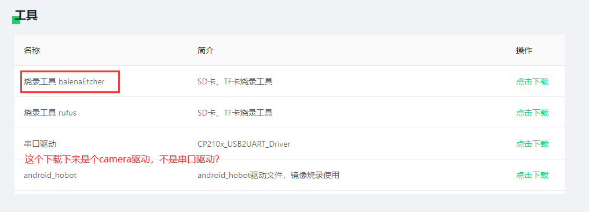  
        * EMMC烧录工具hbupdate  
同样藏在天工开物的工具包中。  
        * 旭日X3派系统镜像（桌面版）（内含EMMC Rom）  
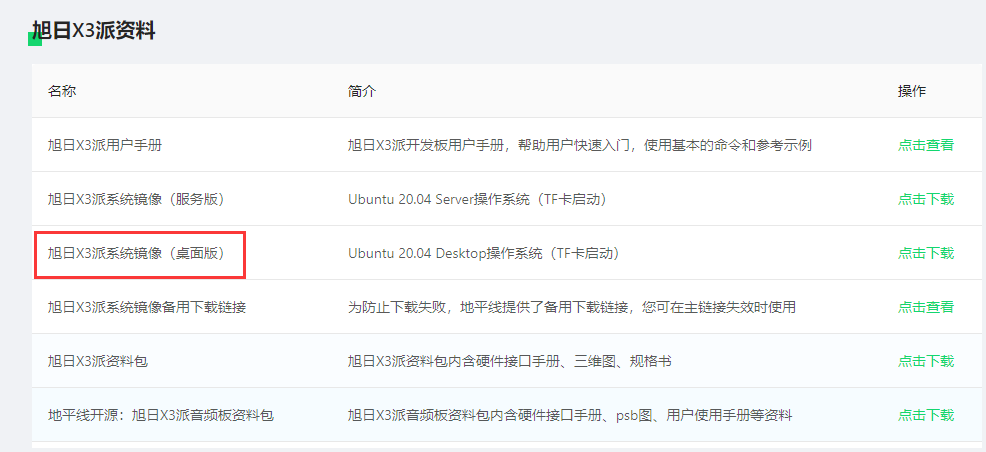  
        * X3SDB Ubuntu 系统镜像（这个没Desktop，和上面的二选一即可）  
    * 天工开物工具包，使用FileZilla匿名打开地址 ftp://vrftp.horizon.ai/Open_Explorer_gcc_9.3.0/2.3.3/  
        * Docker交叉编译镜像，15G  
        * 天工开物工具包，6G  
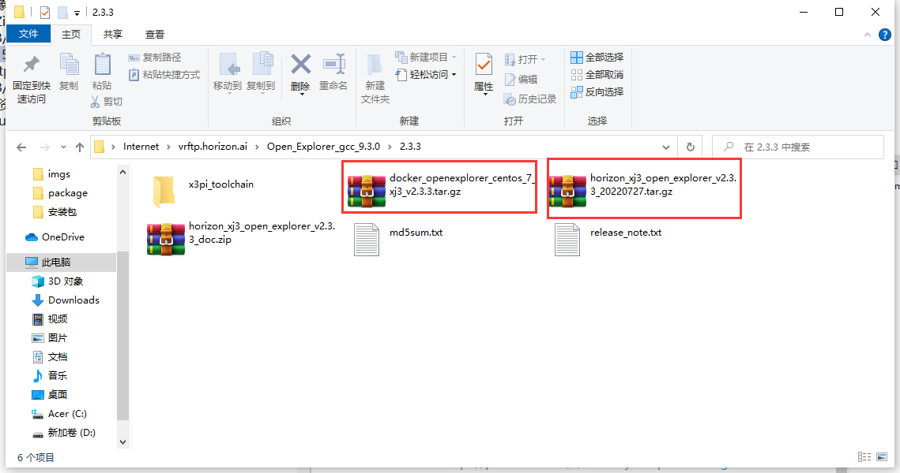  
    * 另一大佬准备好的百度网盘资源包 ，作用基本同上  
        * 链接：https://pan.baidu.com/s/1e8UISrjka2rqns21uv7tQg  
        * 提取码：mfz5  
2. 烧录系统  
    * 安装3个usb转串口驱动，重启  
 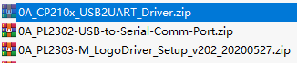  
    * 烧录EMMC  
有三种方式可以烧录EMMC，分别为网络、Micro Usb，串口。当板子变砖头了，则需要使用串口方式，本篇以此为例。  
如下图接好串口转Usb线。  
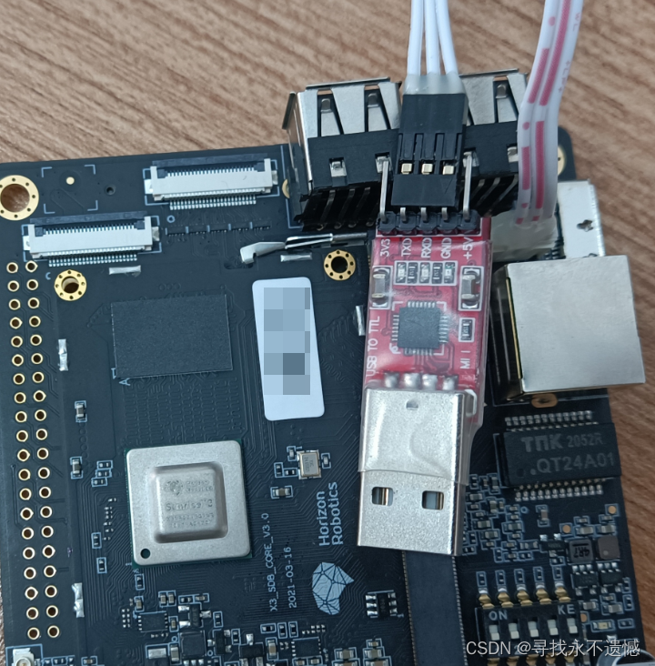  
如果驱动、数据线均无问题，会在设备管理器中看到设备COM口。  
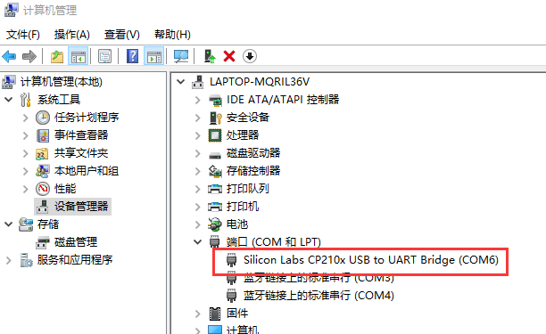  
    * 打开MobaXterm，点击Session -> Serial，设置端口号，波特率921600，Flow control None，保存后双击打开。  
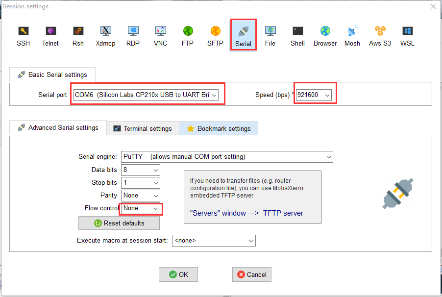  
打开Session后，接上电源（如果接了就拔掉重接），此时会看串口输出系统开机信息。  
如果你已经装好了系统，最后会显示linux的命令行登录窗口。  
关闭Session，准备烧录EMMC。  
    * EMMC Rom和SD卡系统的选择  
由于一些历史原因，笔者刷机刷了x3 sdb emmc + x3 pi Ubuntu desktop。读者也可尝试x3 pi 的emmc，省点下载时间。  
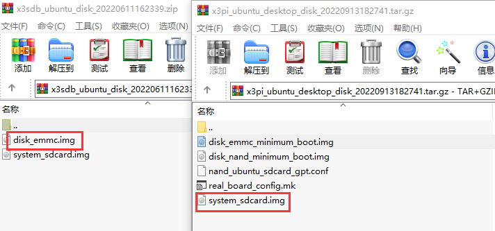  
    * 打开hbupdate，按下面红框修改设置，设好后点击开始升级。  
升级时，首先会提示你拔掉电源，拔掉后点击确定，会继续提示接上电源，接上后按确定即可。如无意外，几分钟后会提示安装成功。  
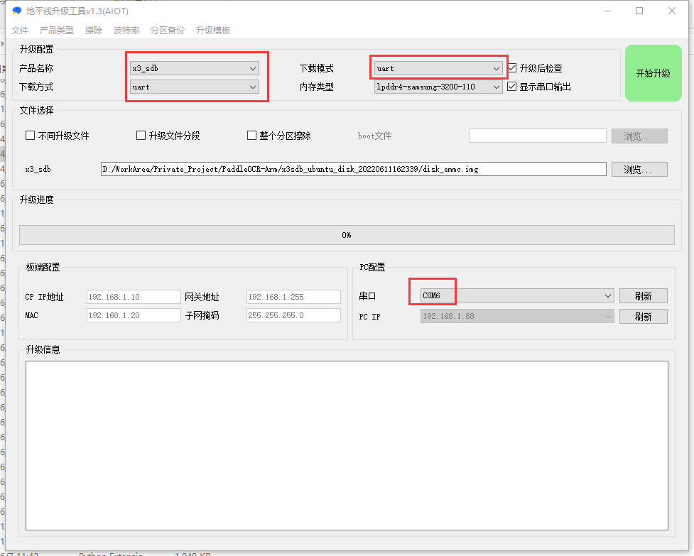  
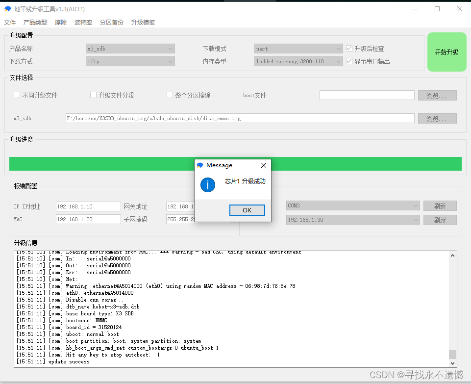  
    * 烧录SD卡  
此时你需要一张SD卡及读卡器。  
打开balenaEtcher.exe，选择x3 pi 镜像及SD，点击Flash。  
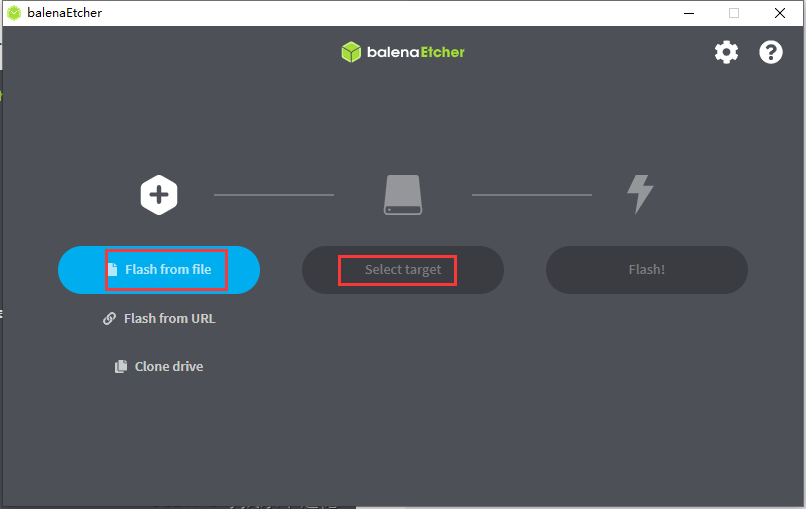  
* 登录系统  
烧录完毕后，拔掉板子电源，插入SD，再次打开MoboXterm，接上电源，输入账号密码root/root。  
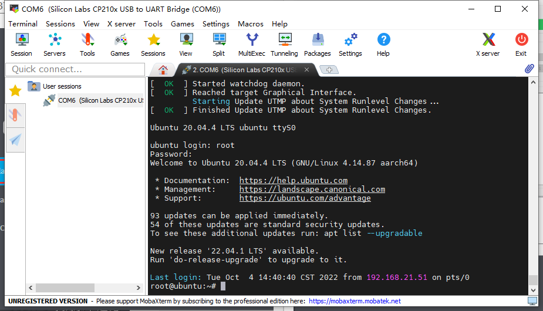  
    * 修改静态IP  
此时默认IP是192.168.1.10，可以按此方式修改IP。  
```bash  
# 修改设置文件  
vim /etc/network/interfaces  
# 保存后重启网络  
/etc/init.d/networking restart  
```  
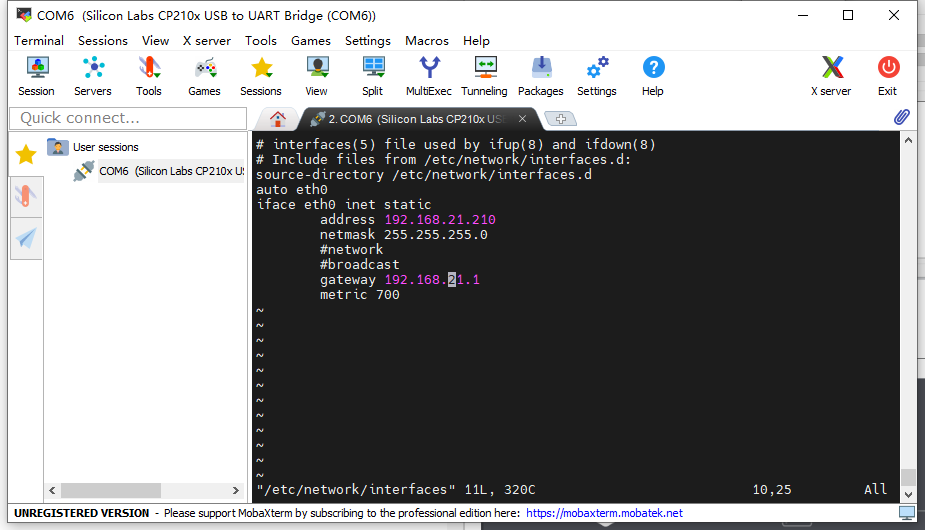  
    * 安装vnc（可选）  
安装命令如下  
```bash  
# a安装软件包  
apt install x11vnc  
# 设置密码  
# 设置后会有一个保存路径，如果读者用的不是root账号，下面脚本内容要相应修改。  
x11vnc -storepasswd  
# 创建开机服务  
vim /lib/systemd/system/x11vnc.service  
```  
开机脚本  
```bash  
[Unit]  
Description=Start x11vnc at startup.  
After=multi-user.target  
[Service]  
Type=simple  
ExecStart=/usr/bin/x11vnc -auth guess -forever -loop -capslock -nomodtweak -noxdamage -repeat -rfbauth /root/.vnc/passwd -rfbport 5900 -shared  
[Install]  
WantedBy=multi-user.target  
```  
启动服务  
```  
systemctl daemon-reload  
systemctl enable x11vnc.service  
systemctl start x11vnc.service  
systemctl status x11vnc.service  
```  
操作完毕后，继续使用MOBAXterm，新建Session -> VNC  
端口在开机脚本中，要一致。  
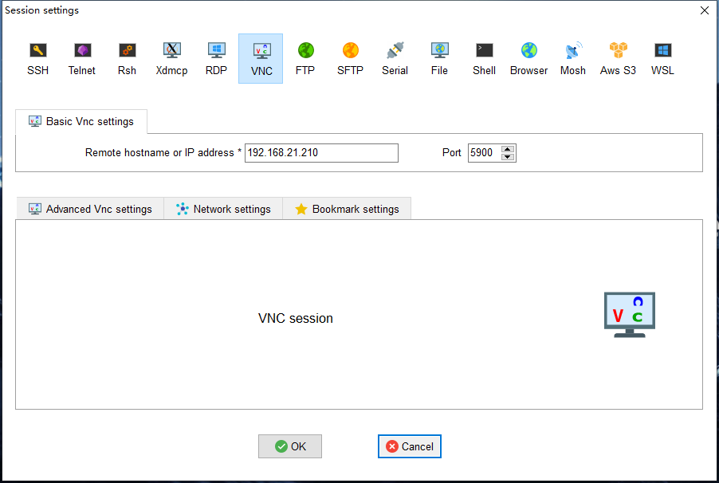  
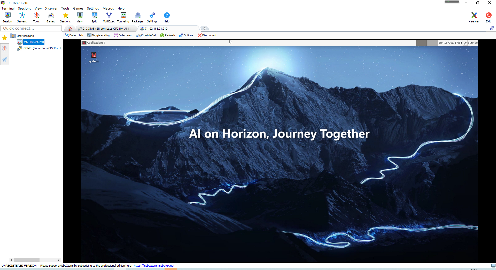  
需要注意，桌面的默认登录账号密码为sunrise/sunrise。  
故，在这里输入某些命令，是需要加sudo的，不要和上面串口的root账号搞混。  

### 三）ONNX实机测试  
笔者以下命令是通过vnc打开板子里的终端操作的，不是串口。  
先使用FileZilla上传onnx_v1的代码。  
笔者用的是usb 摄像头，使用以下命令查找摄像头。  
```bash  
# 这里会有很多个设备，如果不确定是哪个，先拔掉输入一次命令，再插入输入一次  
ls /dev/video*  
# 改为你上传的路径  
cd /home/sunrise/LPR/onnx_v1/ppocr_onnx  
# 改为你的摄像头索引  
python3 main.py 8  
```  
至此笔者能完整运行的部分，已说明完毕。  
下面的BPU篇，笔者能力有限，并未实现一个完整的落地方案。  
### 四）BPU加速推理篇  
先重新说明一下转换路线，paddleocr -> onnx -> onnx bpu。  
onnx转onnx bpu需要在天工开物的docker交叉编译环境中进行。  
首先，强烈建议你读完这两篇文章中的bpu模型转换部分再来操作，否则可能会有点一头雾水。  
[[BPU部署教程] 一文带你轻松走出模型部署新手村](https://blog.csdn.net/Zhaoxi_Li/article/details/125516265)  
[[BPU部署教程] 教你搞定YOLOV5部署 (版本_ 6.2)](https://developer.horizon.ai/forumDetail/112555549341653639)  
在这两篇文章中，你需要搞懂：  
* 如何用docker搭建交叉编译环境。  
下面是笔者的命令。  
```bash  
# 笔者用的是Ubuntu虚拟机里运行docker，和上面文章里的不要一样  
# 第一个-v参数，为了方便上传文件到宿主后，不用再复制进docker容器  
# 第二个-v参数，是天工开物工具包的文件路径  
sudo docker run -it --rm \  
-v /home/walker/horizon:/horizon \  
-v /home/walker/horizon/horizon_xj3_open_explorer_v2.3.3_20220727:/open_explorer \  
hub.hobot.cc/aitools/ai_toolchain_centos_7_xj3:v2.3.3  
```  
* bpu转换模型中yaml配置文件里的参数含义。  
下面是笔者的det和rec的yaml文件，参数含义放在后续结合实例再说。。  
```yaml  
# convert_det.yaml  
model_parameters:  
  onnx_model: 'model.onnx'  
  output_model_file_prefix: 'model'  
  march: 'bernoulli2'  
input_parameters:  
  input_type_train: 'bgr'  
  input_layout_train: 'NCHW'  
  input_type_rt: 'nv12'  
  norm_type: 'data_scale'  
  scale_value: 0.003921568627451  
  input_layout_rt: 'NCHW'  
calibration_parameters:  
  cal_data_dir: './calibration_data'  
  calibration_type: 'max'  
  max_percentile: 0.9999  
compiler_parameters:  
  compile_mode: 'latency'  
  optimize_level: 'O3'  
  debug: False  
  core_num: 2  
```  
```yaml  
# convert_rec.yaml  
model_parameters:  
  onnx_model: 'model.onnx'  
  output_model_file_prefix: 'model'  
  march: 'bernoulli2'  
input_parameters:  
  input_type_train: 'bgr'  
  input_layout_train: 'NCHW'  
  input_type_rt: 'nv12'  
  norm_type: 'data_scale'  
  scale_value: 0.003921568627451  
  input_layout_rt: 'NCHW'  
calibration_parameters:  
  cal_data_dir: './calibration_data'  
  calibration_type: 'max'  
  max_percentile: 0.9999  
compiler_parameters:  
  compile_mode: 'latency'  
  optimize_level: 'O3'  
  debug: False  
  core_num: 2  
```  
其次，你需要重新回顾paddle2onnx的内容。因为paddleocr的例子，输入的sharp是动态的，需要将sharp修改为静态。  
:exclamation:以下命令在paddlepaddle的环境里执行。  
```bash  
# 转化det模型  
paddle2onnx --model_dir ./det/LPR_db_mv3_det/inference ^  
--model_filename inference.pdmodel ^  
--params_filename inference.pdiparams ^  
--save_file ./det/LPR_db_mv3_det/det_onnx/model.onnx ^  
--opset_version 10 ^  
--input_shape_dict="{'x':[1,3,480,640]}" ^  
--enable_onnx_checker True ^  
--enable_dev_version False  
# 转化rec模型  
paddle2onnx --model_dir ./rec/LPR_svtr_mv1e_rec/inference ^  
--model_filename inference.pdmodel ^  
--params_filename inference.pdiparams ^  
--save_file ./rec/LPR_svtr_mv1e_rec/rec_onnx/model.onnx ^  
--opset_version 10 ^  
--input_shape_dict="{'x':[1,3,48,320]}" ^  
--enable_onnx_checker True ^  
--enable_dev_version False  
```  
按PaddleOCR官方说明，改为静态精度会有所降低。  
一些说明：  
* 不同版本的paddle2onnx中，支持的参数不一样，笔者用的是1.0.1  
* opset_version，必须小于11，版本过高无法转换为bpu模型。  
* det的input_shape_dict``{'x':[1,3,480,640]}``，对应bpu转换yaml文件的``NCHW``模式，即{batchsize，颜色，高，宽}。其中高宽是笔者的摄像头分辨率，读者可按实际情况修改。  
<mark>摄像头分辨率是2K、4K什么的就按比例缩小吧，高清大图不现实，严重影响推理性能。</mark>  
* det的input_shape_dict``{'x':[1,3,48,320]}``，这个是v3模型训练时输入的图像大小。  
> 按笔者的理解，这两个sharp估计不会减少转换的精度。  

:exclamation:以下命令在天工开物的环境操作（docker）执行。  
由于笔者没有完整实现，就不放测试代码了，因为比较混乱可能会误导读者。这里以onnx_v1为例。  
* 先把onnx_v1上传到docker里的/horizon文件夹  
* 检查模型是否支持BPU加速。  
```bash  
# 先cd到output父目录再执行  
hb_mapper checker --model-type onnx --march bernoulli2 --model output/det/LPR_db_mv3_det/det_onnx/model.onnx  
hb_mapper checker --model-type onnx --march bernoulli2 --model output/rec/LPR_svtr_mv1e_rec/rec_onnx/model.onnx  
```  
最后没报错即可。  
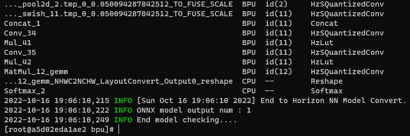  
* 转换onnx bpu模型  
把上面的yaml文件对应放到det_onnx和rec_onnx里。  
det的转换：  
```bash  
# 先cd到det_onnx  
hb_mapper makertbin --config convert_det.yaml --model-type onnx  
```  
成功转接的截图，bin模型文件会输出在model_output里。  
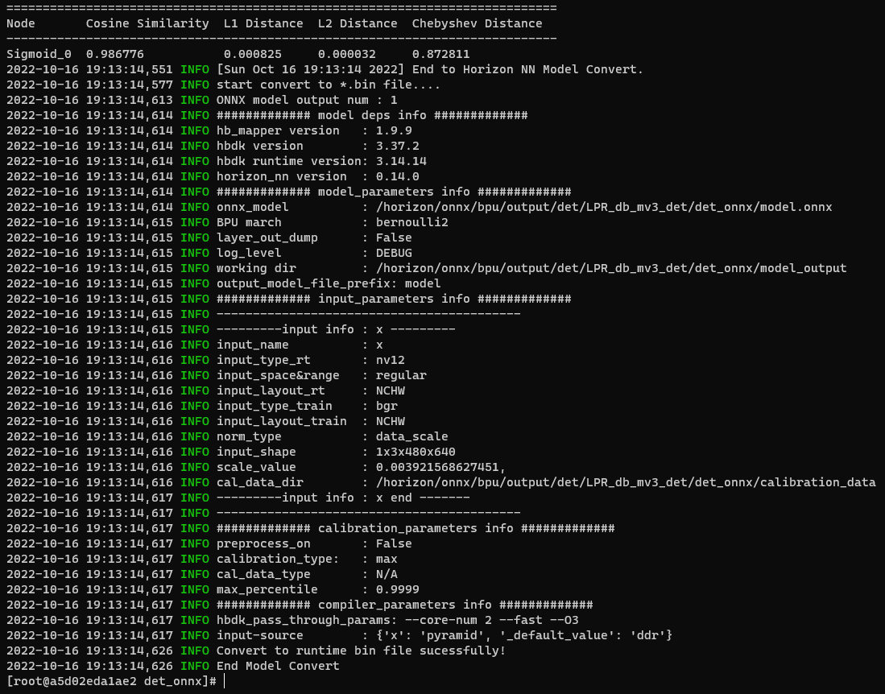  
同理rec的转化：  
```bash  
# 先cd到rec_onnx  
hb_mapper makertbin --config convert_det.yaml --model-type onnx  
```  
截图  
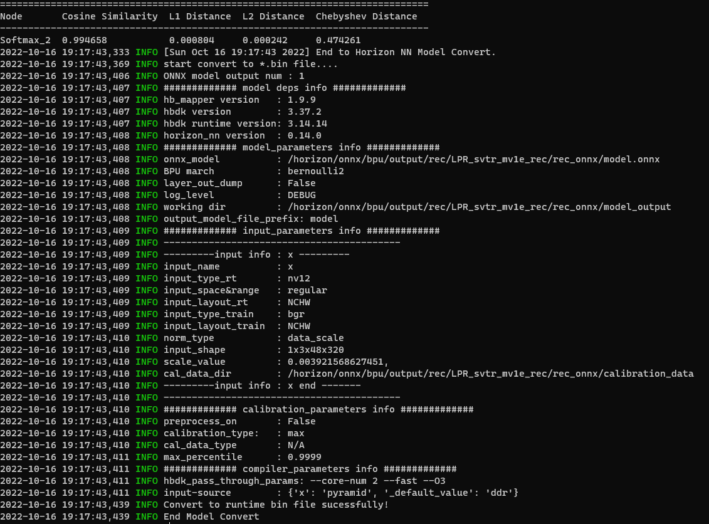  

:exclamation:以下命令在paddlepaddle的环境里执行  
* 上板测试  
det测试（注意需要sudo权限）  
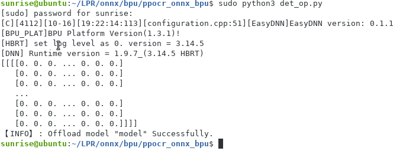  
rec测试  
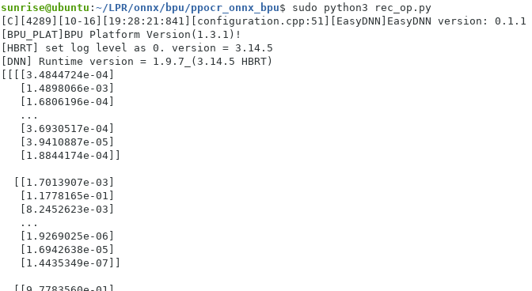  

虽然无法确定结果正不正确，但从性能方面分析，det≈220ms，rec<100ms，预估性能从cpu的1帧每秒提升到2~3帧每秒吧。  

## 五、结语  
对笔者来说，是首次接触arm方面的编程，过程也是一波三折，借了3块板子才做到现在的程度。只可惜最后还是能力有限，没完成后处理部分，略感遗憾。  
至于车牌识别这个立项，是笔者毕业那年所在公司的主营业务。当时笔者作为一个新手，并未接触甚至完全不清楚其中用到什么技术。现在能用自己的技术经验，做个技术路线不一样的车牌识别demo出来，也算是人生的一个回顾吧。  
