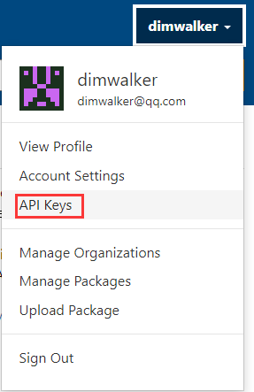
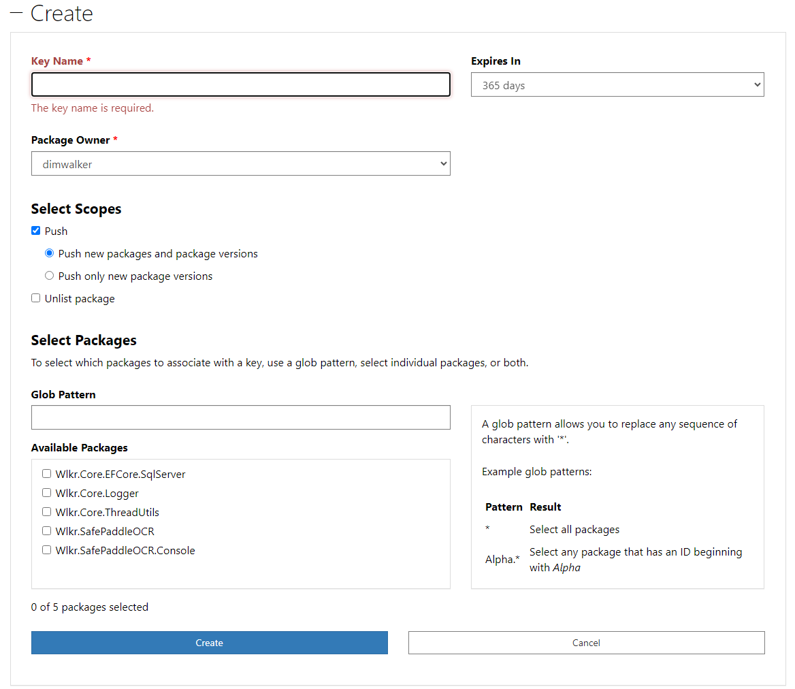
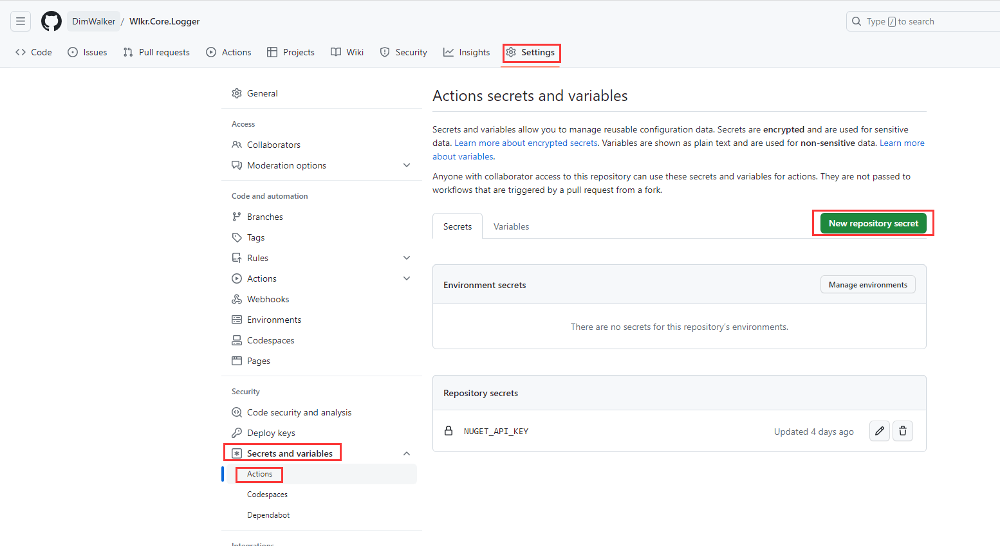
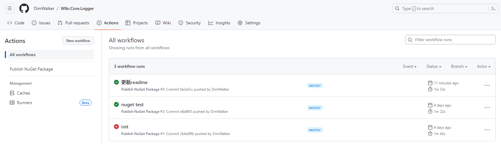
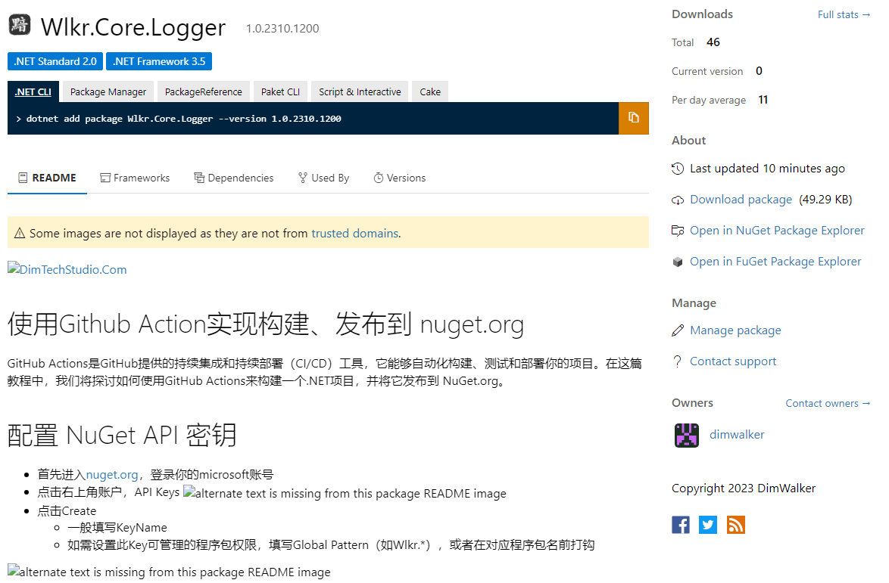
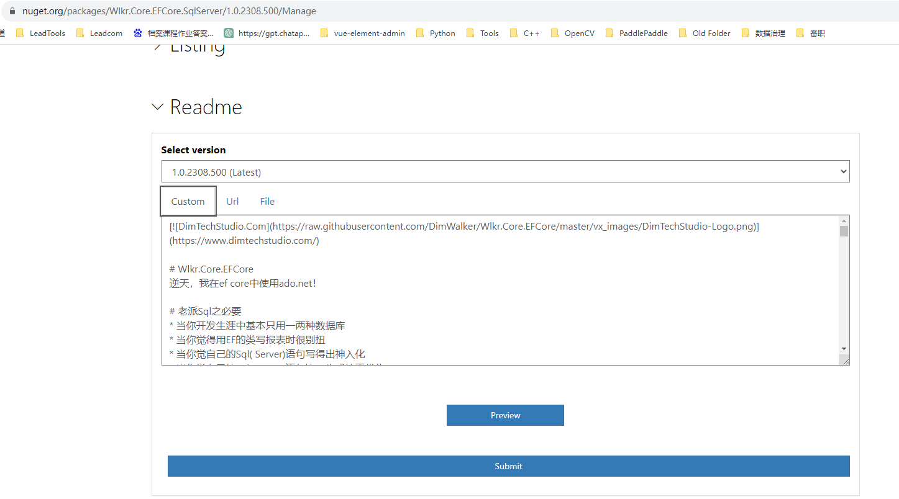

[](https://www.dimtechstudio.com/)  
# 使用Github Actions实现构建、发布到 nuget.org  
GitHub Actions是GitHub提供的持续集成和持续部署（CI/CD）工具，它能够自动化构建、测试和部署你的项目。在这篇教程中，我们将探讨如何使用GitHub Actions来构建一个.NET项目，并将它发布到 NuGet.org。  

## 配置 NuGet API 密钥  
* 首先进入[nuget.org](https://www.nuget.org/)，登录你的microsoft账号  
* 点击右上角账户，API Keys  
  
* 点击Create  
    * 填写KeyName  
    * 如需设置此Key可管理的程序包权限，填写Global Pattern（如Wlkr.*），或者在对应程序包名前打钩  
  
* 生成后，你有一次机会查看此Key的值  
<mark>如果希望将此Key用于多个库，记得保管好此Key，否则只能重新生成或再新建一个Key。</mark>  
## 设置Github Action  
* 登录Github，打开你的remote 代码库 -> Setting -> Secrets and variables -> Actions -> New repository secret，输入刚才复制的Key保存到这里，key名称改为NUGET_API_KEY，后面会用到。  
  
* 然后打开你的local 代码库，新建文件.github\workflows\nuget-publish.yml  
```powershell
mkdir .github\workflows
echo ^ > .github\workflows\nuget-publish.yml
```
* 将以下内容复制进去nuget-publish.yml内保存  
```yaml
name: Publish NuGet Package # Action名称

# 设置触发器
# 以下示例为master分支，Directory.Build.props文件发生变动后，
# 触发本action
on:
  push:
    branches:
      - master # 监听的分支
    paths: # 监听的文件
      - 'Directory.Build.props'

# 设置运行环境及执行步骤
# 作用见step name
jobs:
  build-and-publish:
    runs-on: windows-latest

    steps:
      - name: Checkout code
        uses: actions/checkout@v2

      - name: Setup .NET Core
        uses: actions/setup-dotnet@v1
        with:
          dotnet-version: '6.x' # 修改为你的.NET版本

      - name: Restore NuGet packages
        run: dotnet restore

      - name: Build
        run: dotnet build --configuration Release

      - name: Pack NuGet package
        run: |
          cd Wlkr.Core.Logger
          dotnet pack Wlkr.Core.Logger.csproj  --configuration Release --no-build

      # 需在github库中设置${{ secrets.NUGET_API_KEY }}
      - name: Publish NuGet package
        run: dotnet nuget push **/*.nupkg --api-key ${{ secrets.NUGET_API_KEY }} --source https://api.nuget.org/v3/index.json --skip-duplicate
```

* 新建文件Directory.Build.props，此文件作用是统一设置所有csproj的nuget包信息，如作者、版权、版本号等信息  
> 实际上nuget以外的信息也能设置  
```xml
<Project>
	<PropertyGroup>
		<Authors>Walker Chan</Authors>
		<Company>广州市增城区黯影信息科技部</Company>
		<Copyright>Copyright 2023 DimWalker</Copyright>
	</PropertyGroup>

	<!-- Calculate the build and revision numbers based on the current date -->
	<PropertyGroup>
		<MajorVersion>1</MajorVersion>
		<MinorVersion>0</MinorVersion>
		<BuildDate>2310</BuildDate>
		<RevisionTime>1200</RevisionTime>
		<!--<MinorVersion>$([System.DateTime]::Now.ToString("yy"))</MinorVersion>-->
		<!--<BuildDate>$([System.DateTime]::Now.ToString("MMdd"))</BuildDate>-->
		<!--<RevisionTime>$([System.DateTime]::Now.ToString("HHmm"))</RevisionTime>-->
		<BuildNumber>$(MajorVersion).$(MinorVersion).$(BuildDate).$(RevisionTime)</BuildNumber>
	</PropertyGroup>
	<!-- Use the calculated version for the NuGet package -->
	<PropertyGroup>
		<VersionPrefix>$(BuildNumber)</VersionPrefix>
		<Version>$(VersionPrefix)</Version>
	</PropertyGroup>

	<PropertyGroup>
		<!-- 设置 SolutionDir 属性为解决方案文件的绝对路径 -->
		<SolutionDir>$(MSBuildThisFileDirectory)</SolutionDir>
	</PropertyGroup>
	<ItemGroup>
		<!-- Nuget的Icon文件 -->
		<None Include="$(SolutionDir)vx_images\DimTechStudio-Icon.png">
			<Pack>True</Pack>
			<PackagePath>\</PackagePath>
		</None>
		<!-- Nuget的自述文件 -->
		<None Include="$(SolutionDir)README.md">
			<Pack>True</Pack>
			<PackagePath>\</PackagePath>
		</None>
	</ItemGroup>
	<PropertyGroup>
		<PackageIcon>DimTechStudio-Icon.png</PackageIcon>
		<!--<PackageReadmeFile>README.md</PackageReadmeFile>-->
	</PropertyGroup>
</Project>
```
* 文件中版本号是以1.0.YYMM.DDsn的格式编写，当需要发布时，修改年月日或流水号，git commit并push到remote 代码库即可触发action  
* 效果查看  
  
  

## 更新Nuget README  
* 方法一，如上图，如果在项目文件中设置了README文件，那么只能通过再次发布nuget包来更新README信息  
> 如上图的图片文件是使用了文件件路径，则没法显示在 nuget.org，则需要修改README的图片路径为github url，再次发布才能看得见图片  
* 方法二，取消绑定README，登录nuget.org，进入Manage Package，编辑README信息  
> 缺点是每次发布都需要重复一遍此操作  
  
* 2023-10-13新增方法三，此方法仅适用于[vnote](https://github.com/vnotex/vnote)编写的md文件  
    * 工具下载地址1：[VNoteTools Github](https://github.com/DimWalker/VNoteTools)  
    * 工具下载地址2：[VNoteTools Gitee](https://gitee.com/dimwalker/VNoteTools/)  
    * 将下面代码的github_image_prefix_url，替换为你的代码库，执行命令将README.md转换为README_Nuget.md  
    ```shell  
    VNoteTools.exe -Method NugetMd -InputMdPath "F:\Project_Private\Wlkr.Core.SDK\Wlkr.Core.Logger\README.md" -github_image_prefix_url "https://raw.githubusercontent.com/DimWalker/Wlkr.Core.Logger/master/vx_images/"  
    ```  
    * 修改Directory.Build.props，将整个solution内的项目统一README_Nuget.md  
    ```xml  
	    <PropertyGroup>  
		    <!-- 设置 SolutionDir 属性为解决方案文件的绝对路径 -->  
		    <SolutionDir>$(MSBuildThisFileDirectory)</SolutionDir>  
	    </PropertyGroup>  
	    <ItemGroup>  
		    <!-- Nuget的Icon文件 -->  
		    <None Include="$(SolutionDir)vx_images\DimTechStudio-Icon.png">  
			    <Pack>True</Pack>  
			    <PackagePath>\</PackagePath>  
		    </None>  
		    <!-- Nuget的自述文件 -->  
		    <None Include="$(SolutionDir)README_Nuget.md">  
			    <Pack>True</Pack>  
			    <PackagePath>\</PackagePath>  
		    </None>  
	    </ItemGroup>  
	    <PropertyGroup>  
		    <PackageIcon>DimTechStudio-Icon.png</PackageIcon>  
		    <PackageReadmeFile>README_Nuget.md</PackageReadmeFile>  
	    </PropertyGroup>  
    ```  

## Author Info  
DimWalker  
©2023 广州市增城区黯影信息科技部  
[https://www.dimtechstudio.com/](https://www.dimtechstudio.com/)  
